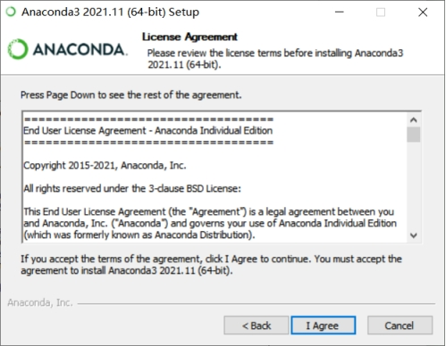
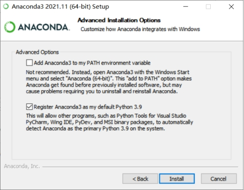
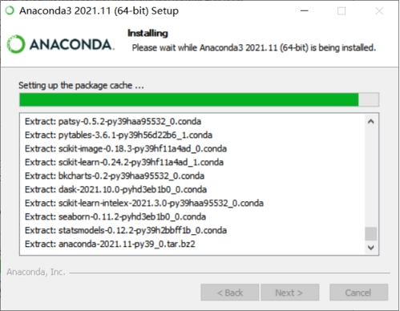
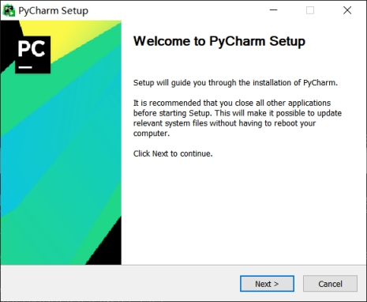
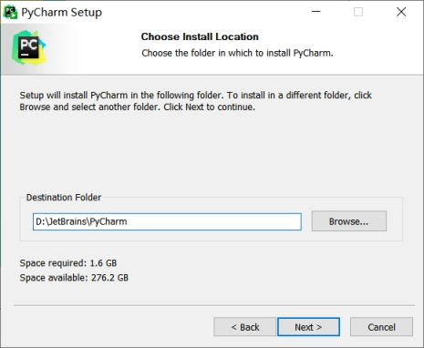
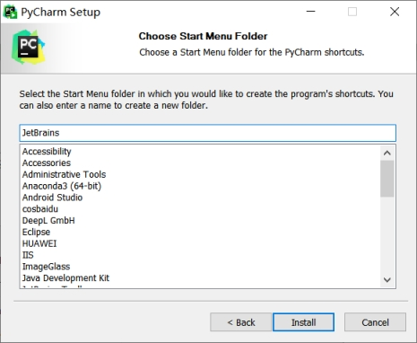
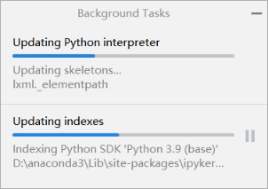

开发环境安装配置

 

Anaconda3

https://www.anaconda.com/

 

 

 

 

 

 

 

 

 

 

 

 

 

 

 

 

 

 

 

 

Pycharm

https://www.jetbrains.com/pycharm/

 

 

 

 

 

 

 

 

 

 

 

 


# 包管理工具

## pip

```shell
pip install -r requirements.txt
```

pip版本降级

python -m pip install pip==9.0.3

其中，-m参数的解释：

run library module as a script (terminates option list)

将库中的python模块用作脚本去运行。

pip -V

## Anaconda

conda info --envs，查看环境
conda create --name yourEnv python=2.7，创建环境
source activate py36，更换环境
conda env export > py36.yaml，导出当前环境
conda env create -f py36.yaml，导入环境

注意：若导出base环境，则在目标机上会提示已存在（而且base环境无法删除）。所以要想导出base，最好先复制一下，再导出复制品：
conda create -n new_name --clone base

再导出new_name环境即可。必要的话再在原机删除复制环境：

conda remove -n new_name --all

在用的时候发现有些module还是未安装，上网找了下原因，原来以上只会导出conda命令直接安装的包，而我的包大多是用pip安装在Anaconda的lib和site-package里了。因此还要用导出pip的方法：

pip导出安装的库到27.txt：

pip freeze > 27.txt

pip导入27.txt中列出的库到新机：

pip install -r 27.txt

https://blog.csdn.net/shunaoxi2313/article/details/92003710

```shell
conda create -n your_env_name python=x.x
```

```shell
conda activate mx_user_manage
```

```shell
conda deactivate
```


