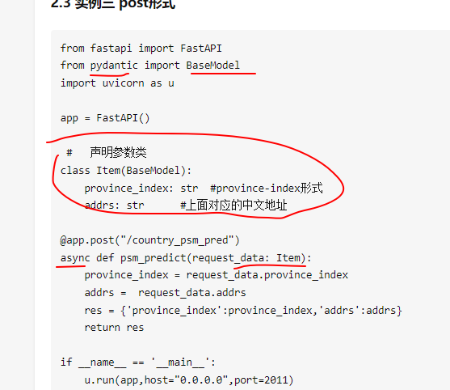
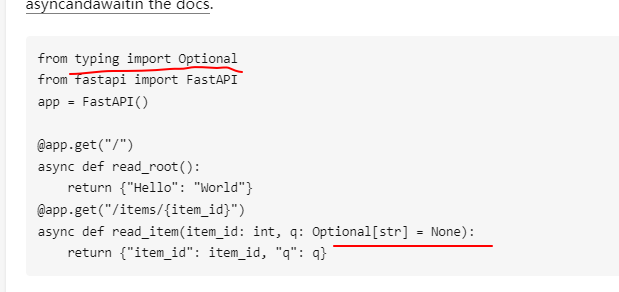

# python数据类型

正向递增序号、反向递增序号

## 数字类型

### 整数类型

取值范围无限制

### 浮点数类型

浮点数取值范围和小数精度都存在限制

取值范围数量级约308次方，精度数量级-16

计算机以二进制存储数据，对于十进制的小数，十进制小数转化为二进制，不一定都能够精确表示。文字描述十进制小数部分转换二进制过程如下：将该数字乘以2，取出整数部分作为二进制表示的第1位；然后再将小数部分乘以2，将得到的整数部分作为二进制表示的第2位；以此类推，直到小数部分为0。 特殊情况： 小数部分出现循环，无法停止，则用有限的二进制位无法准确表示一个小数，这也是在编程语言中表示小数会出现误差的原因.

例如：print(0.1+0.2)，结果为：0.30000000000000004

可以使用round(x,d)函数进行处理，含义是：对x进行四舍五入，d是小数保留位数

二进制表示的小数转换为十进制，例 0.6 = 1 * 2^-1 + 0 * 2^-2 + 0 * 2^-3 + 1 * 2^-4 + ……

### 复数类型

z.real

z.imag

### 数字操作函数

|         函数         |                             含义                             |
| :------------------: | :----------------------------------------------------------: |
|        abs(x)        |                          x的绝对值                           |
|     divmod(x,y)      |             商余，(x//y,x%y)，同时输出商数和余数             |
|     pow(x,y[,z])     |                 幂余，(x**y)%z，参数z可缺省                  |
|     round(x[,d])     |             四舍五入，d是保留小数位数，默认值为0             |
| max(x1,x2,x3,...,xn) |                        最大值，n不限                         |
| min(x1,x2,x3,...,xn) |                        最小值，n不限                         |
|        int(x)        | 将x变为整数，舍弃小数部分，非四舍五入，int(123.5)==123，int("123.5")==123 |
|       float(x)       | 将x变为浮点数，增加小数部分，int(123)==123.0，int("123")==123.0 |
|      complex(x)      |                  将x变为复数，增加虚数部分                   |


## 组合类型

## 集合类型

集合是多个唯一元素的无序集合。

集合元素不可更改，为非可变数据类型。集合用大括号{}表示，元素之间用逗号分隔。集合中元素唯一，不存在相同元素。集合元素之间无序。

### 集合操作符

|  集合操作符  |                   含义                   |
| :----------: | :--------------------------------------: |
|    S \| T    |    并，返回一个集合，包含S、T所有元素    |
|    S - T     | 差，返回一个集合，包含在S但不在T中的元素 |
|    S & T     |   交，返回一个集合，包含S、T都有的元素   |
|    S  ^ T    |  返回一个集合，包含S、T中互不相同的元素  |
| S <=T 或 S<T |     返回boolean，判断S和T的子集关系      |
| S>=T 或 S>T  |     返回boolean，判断S和T的包含关系      |
|   S \|= T    |  更新集合S，包括在集合S和T中的所有元素   |
|    S -= T    |  更新集合S，包括在集合S但不在T中的元素   |
|    S &= T    |  更新集合S，包括同时在集合S和T中的元素   |
|    S ^= T    |  更新集合S，包括集合S和T中非相同的元素   |

### 集合操作函数

| 集合操作函数 |               含义                |
| :----------: | :-------------------------------: |
|    len(s)    |        返回集合s的元素个数        |
|    x in s    |  返回boolean，判断x是否在集合s中  |
|  x not in s  | 返回boolean，判断x是否不在集合s中 |
|    set(x)    |     将其他变量x转换为集合类型     |

### 集合处理方法

| 集合处理方法 |                         含义                          |
| :----------: | :---------------------------------------------------: |
|   s.add(x)   |               若x不在集合中，将x增加到s               |
| s.discard(x) |        移除s中的元素x，若x不在集合s中，不报错         |
| s.remove(x)  |   移除s中的元素x，若x不在集合s中，产生KeyError异常    |
|  s.clear()   |                    移除s中所有元素                    |
|   s.pop()    | 随机返回s的一个元素并更新s，若s为空，产生KeyError异常 |
|    s.copy    |                  返回集合的一个副本                   |

## 序列类型

字符串类型、元组类型、列表类型都属于序列类型。序列类型的所有操作都适用于三者。

### 序列操作符


### 序列操作函数和序列处理方法


## 字符串类型

有零个或者多个字符组成的有序字符序列。python字符串中每个字符都是Unicode编码，每个字符占据两个字节。

### 字符串表示方式

单行字符串：单引号对、双引号对

多行字符串：三单引号对、三双引号对

### 字符串切片

<字符串>[M:N:K]

### 字符串操作符

| 字符串操作符 |     含义     |
| :----------: | :----------: |
|      +       | 字符串连接符 |
|      *       | 字符串复制符 |
|      in      |  子串判断符  |

### 字符串操作函数

|  字符串操作函数  |                             含义                             |
| :--------------: | :----------------------------------------------------------: |
|      len(x)      |                      返回字符串x的长度                       |
|      str(x)      | 返回任意类型x对应的字符串形式，str(1.23)结果为"1.23"，str([1,2])结果为"[1,2]" |
| eval(expression) | eval() 函数用来执行一个字符串表达式，并返回表达式的值。eval('print('hello')')，结果为hello |
|      hex(x)      |              返回整数x的十六进制小写形式字符串               |
|      oct(x)      |               返回整数x的八进制小写形式字符串                |


### 字符串处理方法

|         字符串处理方法          |                             含义                             |
| :-----------------------------: | :----------------------------------------------------------: |
|         string.lower()          |                 返回字符串副本，全部字符小写                 |
|         string.upper()          |                 返回字符串副本，全部字符大写                 |
|     string.split(sep=None)      | 返回一个列表，由string根据被分隔的部分组成，"A,B,C"split(",")结果为['A','B','C'] |
|        string.count(sub)        |    返回字串在string中出现的次数，"aaa".count("aa")结果为1    |
|     string.replace(o;d,new)     |            返回字符串副本，所有old字串被替换为new            |
| string.center(width[,fillchar]) |            字符串根据宽度width居中，filler可缺省             |
|       string.strip(chars)       | 在string左侧和右侧去掉chars中列出的字符，逐一去除直至非chars所列字符 |
|        string.join(iter)        |           在字符串中相邻两个字符之间增加字符串iter           |

## 元组类型

元组是一种序列类型，一但创建就不能修改。使用小括号()或者tuple()创建，元素间用逗号,分隔。可以省略小括号。


## 列表类型

列表创建后可以随意修改。列表使用方括号[]或者list()创建，元素间用逗号,分隔。注意，方括号[]真正创建一个列表，赋值仅仅传递引用。

### 列表操作符

|   列表操作符   |                    含义                    |
| :------------: | :----------------------------------------: |
|   ls[i] = x    |           替换列表ls第i位元素为x           |
| ls[i:j:k] = lt |   用列表lt替换ls切片后多对应的子元素列表   |
|    ls += lt    | 更新列表ls，将列表lt中的元素增加到列表ls中 |
|    ls *= n     |        更新列表ls，将其元素重复n次         |

### 列表操作函数

| 列表操作函数  |               含义                |
| :-----------: | :-------------------------------: |
|   del ls[i]   |        删除ls列表中第i元素        |
| del ls[i:j:k] | 删除列表ls中第i到j以k为步长的元素 |


### 列表处理方法

|  列表处理函数  |                 含义                  |
| :------------: | :-----------------------------------: |
|  ls.append(x)  |       在列表ls最后增加一个元素x       |
|   ls.clear()   |         删除列表中所有的元素          |
|   ls.copy()    | 生成一个新的列表，赋值ls中所有的元素  |
| ls.insert(i,x) |       在列表的第i位置增加元素x        |
|   ls.pop(i)    | 将列表ls中第i位置元素返回并删除该元素 |
|  ls.remove(x)  |    将列表ls中出现的第一个元素x删除    |
|  ls.reserve()  |         将列表ls中的元素反转          |

## 字典类型

字典是键值对的集合，键值对之间无序。采用大括号{}和dirc()创建，键值对用冒号:表示。

<字典变量>={<键>:<值>,...,<键>:<值>}

<值>=<字典变量>[<键>]

<字典变量>[<键>]=<值>

[]用来向字典变量中索引或增加元素

### 字典类型操作符

| 字典类型操作符 |               含义                |
| :------------: | :-------------------------------: |
|     k in d     | 返回boolean，判断k键是否在字典d中 |

### 字典类型操作函数

| 字典类型操作函数 |            含义            |
| :--------------: | :------------------------: |
|     del d[k]     | 删除字典d中键k对应的键值对 |
|      len(k)      |    返回字典中元素的个数    |

### 字典类型处理方法

|  字典类型处理方法  |                       含义                       |
| :----------------: | :----------------------------------------------: |
|      d.keys()      |             返回字典d中所有键的信息              |
|     d.values()     |             返回字典d中所有值的信息              |
|     d.items()      |           返回字典d中所有键值对的信息            |
| d.get(k,<default>) |    若键k存在，返回相应值，反之返回<default>值    |
| d.pop(k,<default>) | 若键k存在，返回并删除相应值，反之返回<default>值 |
|    d.popitem()     |   随机从字典d中以元组形式返回并删除一个键值对    |
|     d.clear()      |              删除字典d中所有键值对               |

# python运算符

## 算术运算符

| 算术运算符 | 运算符名称 |
| :--------: | :--------: |
|     +      |  加、正号  |
|     -      |  减、负号  |
|     *      |     乘     |
|     /      |   浮点除   |
|     //     |   整数除   |
|     %      |    取余    |
|     **     |  幂运算符  |
|     +=     |    加等    |
|     -=     |    减等    |
|     *=     |    乘等    |
|     /=     |  浮点除等  |
|    //=     |  整数除等  |
|     %=     |   取余等   |
|    **=     |    幂等    |


### 数据类型

python中所有的变量中存储的类型都是引用数据类型，引用数据类型没有常量形式

常量包括int、float、str、

常量就是基本的那一些

可变数据类型、不可变数据类型

可变数据类型：当该数据类型对应的变量的值发生了变化时，如果它对应的内存地址不发生改变，那么这个数据类型就是 可变数据类型。

不可变数据类型：当该数据类型对应的变量的值发生了变化时，如果它对应的内存地址发生了改变，那么这个数据类型就是 不可变数据类型。

总结：可变数据类型更改值后，内存地址不发生改变。不可变数据类型更改值后，内存地址发生改变。

除基本类型之外tuple也是不可变的，以上都指对象，类似于java中的final，java中的包装类和string

不可变数据类型是


不可变数据类型又有两类，一类是常量池，一类是不在常量池的


字符串可以使用r不进行转移，保留原始字符串


Number，bool，int，float、complex，（无long）

String

Tuple

List

Dictionary

Set


基本数据类型，引用数据类型，python中一切皆对象


变量命名规则：字母、数字、下划线组成，数字不作为开头

```python
# 标准数据类型
# Python3 中有六个标准的数据类型：
#
# Number（数字）, int、float、bool、complex
# String（字符串）
# List（列表）
# Tuple（元组）
# Set（集合）
# Dictionary（字典）
# Python3 的六个标准数据类型中：
#
# 不可变数据（3 个）：Number（数字）、String（字符串）、Tuple（元组）；
# 可变数据（3 个）：List（列表）、Dictionary（字典）、Set（集合）。

# 整数无限存储
```


数据类型转换

```python
# 数据类型转换

# str -> bool
# 非空字符串为真，空字符串为假
```


```python
# 基本数据类型,int,str,bool
print(100, type(100))
print('100', type('100'))
print('100' * 10)
print(True, type(True))

# 字符串 '',""
print('''
1
2
3
''')
```


```python
x = [
    "12",
    "21"
    "1e",
    "er"
]
```

实际上只有三个元素


Python字典查找报Keyerror解决方法

Python的字典一般都直接查找key ，比如

```
dict={'a':1,'b':2,'c':3}
print(dict['a'])
```

比如你要查看print(dict['d'])

由于这个时候dict里面并没有这个key ,所以就会直接报错，那么这个时候其实python给我们提供了一种很棒的解决方法，那就是用

```
setdefault,用法如下： dict.setdefault(key,[这里设置如果不存在想将值设置为啥，默认为None])
```


Python中的None与Null（空字符）的区别

#  Python中的None与Null（空字符）的区别

nil
英 [nɪl]   美 [nɪl]  

n.无;(数码)零;(体育比赛中的)0分


参考自 Python中的None与空字符(NULL)的区别 - CSDN博客 http://blog.csdn.net/crisschan/article/details/70312764

首先了解python对象的概念

python中，万物皆对象，所有的操作都是针对对象的。 那什么是对象？5是一个int对象，‘oblong’是一个str对象，异常也是一个对象，抽象一点是，人，猫，够也是一个对象

那对于一个对象，它就有包括两方面的特征： 
属性：去描述它的特征 
方法： 它所具有的行为 
所以，对象=属性+方法 （其实方法也是一种属性，一种区别于数据属性的可调用属性）

类：把具有相同属性和方法的对象就可以归为一类，即class。使用一个类可以创建多个对象实例，即人，猫，狗都属于哺乳动物类。类是对象的抽象化，对象是类的实例化。类不代表具体的事物，而对象表示具体的事物 

类也是有属性和方法的。

 

数据类型也是对象

实际上Pyhton在面向对象程序设计时，才会有对象这个概念，而在面向过程型程序设计时，我们讨论最多的就是数据类型。

Python提供的基本数据类型主要有：布尔类型、整型、浮点型、字符串、列表、元组、集合、字典等。

整个数据类型也可以看做是一个”类“ 。每一种数据类型都是一个对象，也具有其自己的属性和方法

 

了解以上概念，就不难理解None 与Null的区别 

1）是不同的数据类型

In[3]: type(None)
Out[3]: NoneType

表示该值是一个空对象，空值是Python里一个特殊的值，用None表示。None不能理解为0，因为0是有意义的，而None是一个特殊的空值。可以将None赋值给任何变量，也可以给None值变量赋值

```
In[4]: type('')
Out[4]: str
```

字符型

2）判断的时候 均是False，没有打印


```
a = None
if a:
    print(1)
    
b = ''
if b:
    print(1)
    
```


3）属性不同

使用dir()函数返回参数的属性、方法列表。如果参数包含方法dir()，该方法将被调用。如果参数不包含dir()，该方法将最大限度地收集参数信息。


```
dir(None)
['__bool__', '__class__', '__delattr__', '__dir__', '__doc__', '__eq__', '__format__', '__ge__', '__getattribute__', '__gt__', '__hash__', '__init__', '__le__', '__lt__', '__ne__', '__new__', '__reduce__', '__reduce_ex__', '__repr__', '__setattr__', '__sizeof__', '__str__', '__subclasshook__']

dir('')
['__add__', '__class__', '__contains__', '__delattr__', '__dir__', '__doc__', '__eq__', '__format__', '__ge__', '__getattribute__', '__getitem__', '__getnewargs__', '__gt__', '__hash__', '__init__', '__iter__', '__le__', '__len__', '__lt__', '__mod__', '__mul__', '__ne__', '__new__', '__reduce__', '__reduce_ex__', '__repr__', '__rmod__', '__rmul__', '__setattr__', '__sizeof__', '__str__', '__subclasshook__', 'capitalize', 'casefold', 'center', 'count', 'encode', 'endswith', 'expandtabs', 'find', 'format', 'format_map', 'index', 'isalnum', 'isalpha', 'isdecimal', 'isdigit', 'isidentifier', 'islower', 'isnumeric', 'isprintable', 'isspace', 'istitle', 'isupper', 'join', 'ljust', 'lower', 'lstrip', 'maketrans', 'partition', 'replace', 'rfind', 'rindex', 'rjust', 'rpartition', 'rsplit', 'rstrip', 'split', 'splitlines', 'startswith', 'strip', 'swapcase', 'title', 'translate', 'upper', 'zfill']
```


```python
dict.get(key[, value]) 
```


字符串格式化

https://blog.csdn.net/dawanhjiao/article/details/122895103


```python
from collections import Counter   #引入Counter
a = [29,36,57,12,79,43,23,56,28,11,14,15,16,37,24,35,17,24,33,15,39,46,52,13]
b = dict(Counter(a))
print ([key for key,value in b.items()if value > 1])  #只展示重复元素
print ({key:value for key,value in b.items()if value > 1})  #展现重复元素和重复次数
```


Python——re.search().group()

https://blog.csdn.net/sinat_20174131/article/details/77769309


# 类型提示，type hint

python类型提示不一致时并不影响程序本身执行


类型提示两种实现方式：

Type Annotation

```python
import math

def circumference(radius: float) -> float:
    return 2 * math.pi * radius
print(circumference.__annotations__)

def test(request_data : Any):
    pass
```

- 使用`：`语句将信息附加到变量或函数参数中。，
- `->`运算符用于将信息附加到函数/方法的返回值中。

这种方法的好处是：

- 这是实现类型提示的规范方式，这意味着是类型提示中最干净的一种方式。
- 因为类型信息附加在代码的右侧，这样我们可以立刻明晰类型。

缺点是：

- 它不向后兼容。至少需要Python 3.6才能使用它。
- 强制你导入**所有**类型依赖项，即使它们根本不在运行时使用。
- 在类型提示中，会使用到复合类型，例如`List[int]`。而为了构造这些复杂类型，解释器在首次加载此文件时需要执行一些操作。

即在运行时基本上将所有类型信息作为注释处理。

为了解决这些矛盾，Python 3.7引入了 [PEP-563 ~ postponed evaluation of annotations](https://www.python.org/dev/peps/pep-0563/) 。

加入以下语句，解释器将不再构造这些复合类型。

```
from __future__ import annotations
```


Type Comment

```python
# headlines.py
def headline(
    text,           # type: str
    width=80,       # type: int
    fill_char="-",  # type: str
):                  # type: (...) -> str
return f" {text.title()} ".center(width, fill_char)

print(headline("type comments work", width=40))
```


鸭子类型，不通过其本身类型判断类型，而是通过其属性、表现判断







python typing、pydantic，两个做类型和格式检查


```
数据类型
数字类型：bool、int、flout（无double）、complex 不可变
组合类型：
序列：
     字符串   有序   不可变     可重复
     元组     有序  不可变     可重复
     列表     有序  可变       可重复
集合          无序  可变       不可重复
字典          无序  可变       不可重复（指key）

三个可变，三个不可变
```


```python
"""
字符串
"""
s = "  davis JoNes_aBc  "
print(s.capitalize())
print(s.upper())
print(s.lower())
print(s.swapcase())
print(s.title())
print(s.startswith("Da"))
print(s.endswith("Bc"))
print(s.count("a"))
print(s.find("a"))  # 找不到返回-1
print(s.find("aB"))
print(s.replace('davis', 'DAVIS'))
print(s.index("JoNes"))  # 找不到抛出异常
print(s.join("      "))
print(s.strip())
print(s.strip(" "))
print(s.rstrip(" "))
print(s.lstrip(" "))
print(s.split())
print(s.split(" "))
print(s.split("a"))

s = '我是{}，今年{}岁，学习进度为{}%'.format("davis", 18, 3)
print(s)

s = '我是{}，今年{}岁，学习进度为{}%'.format("davis", 18, 3)
print(s)

s = '我是{2}，今年{1}岁，学习进度为{1}%'.format("davis", 18, 3)
print(s)

s = '我是{name}，今年{age}岁，学习进度为{process}%'.format(name="davis", age=18, process=3)
print(s)

print(s[3])
print(s[2:6])
print(s[::])
print(s[::-1])
# 字符串索引切片

# 字符串与列表相互转换，join、split
print(' '.join(['1', '2', '3', '4', '5']))

# 字符串%格式化输出，仅有%s、%d
name = input("请输入姓名：")
age = input("请输入年龄：")
process = input("请输入学习进度：")
msg = "我是%s，今年%s岁，学习进度为%s%%" % (name, age, process)  # 前面%为转义标识，即%%输出%
print(msg)
```


```python
"""
元组
"""
t = (1, 2, 3, 'tuple', [1, 'tuple'])
t[4][0] = 2
print(t)
```


```python
"""
列表
"""
l = [1, 2, 3]
# 索引切片同字符串，增删改查
l.append('4')
l.pop(-1)
l.extend((1, 2, 3))
l.remove(1)
l.clear()

l[0:1] = '123457890'  # 根据切片修改，有多少改多少
print(len(l))
l.sort(reverse=True)
l.reverse()
```

```python
"""
集合
"""
s = {1, 2, 3}
# frozenset
```


```python
"""
字典
"""
d = {'1': 1, '2': 2, '3': 3}
a = [1]
d = {a: 12}
a = 2
print(d)

# 字典的key需要是基本数据类型？
# 增
d[2] = 2
# 删
d.keys()
d.values()
d.copy()
d.clear()
d.get(1, 'NULL')
k, v = d.items()
d.setdefault(1, 12)  # 有键值对不更改，无则使用值更改
d.pop(100, '123')
d.popitem()  # 随机删除
d2 = {1: 2, 4: 4}

d.update(d2)  # 字典更新

a, b = 1, 2
b, a = a, b

# builtins
```


```python

# 正则表达式
# python内置模块

# re
import re

pattern = ""
str_ = ""

result = re.search(pattern, str_)
print(result.group() if result else None)

result = re.match(pattern, str_)  # 必须从头匹配
print(result.group() if result else None)

result = re.findall(pattern, str_)
print(result)

result = re.finditer(pattern, str_)  # 找的内容比较多的时候
for i in result:
    print(i.group() if i else None)

result = re.split(pattern, str_)

result = re.sub(pattern, 'O', str_)
print(result)
obj = re.compile(pattern)
result = obj.search(str_)
print(result)

pattern = "/\b[\w.%+-]+@[\w.-]+\.[a-zA-Z]{2,6}\b/g"
str_ = "abcd test1@jld.com 1234 test2@jld.com"
result = re.search(pattern, str_)
print("---", )
print(result.group() if result else None)

# () 表示捕获分组，() 会把每个分组里的匹配的值保存起来，python分组优先加?
```


```python
# 数据类型

print(bytes())
print(bool())
print(int())
print(float())
print(complex())

print(list())
print(tuple())
print(str())
print(dict())
print(set())
```

```python
import datetime
import decimal

now = datetime.datetime.now()
if now.hour < 15:
    reject_time = (datetime.datetime.now() + datetime.timedelta(days=1)).strftime("%Y-%m-%d %H:%M:%S")


print("{:.2f}".format(1313131553.321515))
print("{:,}".format(decimal.Decimal("{:.2f}".format(1))))
print("{:,}".format(decimal.Decimal("{:.2f}".format(decimal.Decimal("1231231.3232")))))
```


```python
d1 = {}
d1['a'] = 1
d1['b'] = 2
d1['d'] = 4
d1['c'] = 3  # 此时的d1 = {'a':'A','b':'B','c':'C','d':'D'}
for k, v in d1.items():
    print(k, v)

import collections

d1 = collections.OrderedDict()  # 将普通字典转换为有序字典
d1['a'] = 1
d1['b'] = 2
d1['d'] = 4
d1['c'] = 3
for k, v in d1.items():
    print(k, v)

d1 = {'a': '1', 'b': '2', 'd': '4', 'c': '3'}
d1 = collections.OrderedDict(d1)
for k, v in d1.items():
    print(k, v)


# Python3.6 改写了 dict 的内部算法，Python3.6 版本以后的 dict 是有序的，所以也就无须再关注 dict 顺序性的问题
```


```python
# print(id([]))
# print(id([123]))
# print(id([12]))
#
# m = [23]
# print(id(m))
# print(id([]))


def add(a=[]):
    a.append(1)
    print(a)
    print(id([]))
    b = []
    print(id(b))
    v = []
    print(id(v))


# f = add
#
# f()
#
# b = []
add()
g = [1]
print(id(g))
# []可能与缓存机制有关
# 函数中的默认参数会在加载函数时保存在堆中，如果默认参数是可变参数，就会在多次调用函数间有累积作用
# 两种情况是不同机制


```