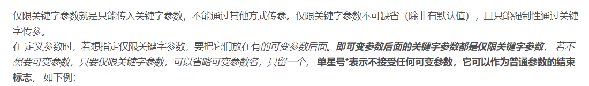

Python print()向上取整


**参数**
`values`，可以一次输出多个对象。输出多个对象时，需要用 , 分隔。

`sep`，用来间隔多个对象，默认值是一个空格。

`end`，用来设定以什么结尾。默认值是换行符 \n，我们可以换成其他字符串。

`file`，要写入的文件对象。

`flush`，输出是否被缓存通常决定于 file，但如果 flush 关键字参数为 True，流会被强制刷新。

**返回值**
无

Python numpy.ceil()

参数
x -- 数值表达式。
返回值
函数返回数字的上入整数。

python numpy.floor

### numpy.floor()

numpy.floor() 返回小于或者等于指定表达式的最大整数，即向下取整。





没有类的情况下，模块中的_get、__get方法就是普通方法


```python
"""
函数
"""


# 函数的参数：位置参数（基本参数）、默认参数、可变参数、关键字参数和命名关键字参数
# 解释器处理顺序？ 基本参数、默认参数、可变参数、命名关键字参数和关键字参数
# （基本）可变参数、命名关键字参数、（命名）关键字（可变）参数


# 默认参数，要放在最左边

def calc(i=0):
    return i


# 可变参数，可变参数将以元组方式传递

def sum1(a, b, *args):  # 默认为元组,无法接受关键字传参
    print(a, b)
    res = 0
    for i in args:
        res += i
    return res


# 函数参数的自动装包与拆包
# *args会把多余参数打包
# 打包之后的类型为元组
# 即元组与列表的打印拆包中总结，只能默认拆包元组，如果是列表就先转换成元组在拆包
a = [1, 2, 3, 4, 5]
a1, a2, a3, a4, a5 = a
print(sum1(*a))


# 关键字参数，关键字参数将以字典方式传递
def sum2(**kwargs):
    print(kwargs, type(kwargs))


# 默认参数为可变类型数据容器,会共享
# 不要使用可变类型的数据容器作为默认参数（包括列表，字典），但是可以作为位置参数使用


print(print)  # 函数的内存地址

# locals 与 globals
print(globals())  # 无fun,因为一行一行执行


def fun():
    x, y = 1, 2
    print(locals())


print(locals())
fun()


# 匿名函数
# 匿名函数
def pow2(n):
    return n ** 2


print(pow2(10))
calc = lambda n: n ** 2
print(calc(10))

add = lambda x, y: x + y

l = [-2, 4, -9, 4, 7, 8]
print(max(l, key=lambda n: n * n))

# 内置函数带key
# max、min、filter、map、sorted

```

```python
"""
函数闭包
"""


def outer():
    print("outer")

    def inner():
        print("inner")

    inner()


outer()

# 报错从下往上找


a = 1


def ff():
    a = 2  # 这是一个局部的a，赋值不影响，但是使用值时会有不同情况

    def fff():
        global a
        a = 3
        print(a)

    fff()
    print(a)


ff()
print(a)


# 函数名可以作为一般值使用, 函数参数\函数返回值\容器元素、函数名就是内存地址,
# 闭包函数,闭包函数通过将函数名作为返回值使得不释放局部变量引用而保留局部变量
def nth_power(n):
    def power(base):
        return base ** n

    return power


power = nth_power(3)
print(power.__closure__)
print(power(2))

```

```python
# 装饰器标准模板
# 装饰器函数\装饰器类,以函数作为装饰器\以类作为装饰器
def wrapper():
    def outer(func):
        def inner(*args, **kwargs):
            res = func(*args, **kwargs)
            return res

        return inner

    return outer


@wrapper()
def user():
    print("use")


user()

```

```python

"""
debug的一个例子

无参装饰器
"""


def debug(func):
    def wrapper(*args):
        print("[DEBUG]: function {}".format(func.__name__))
        return func(*args)

    return wrapper


@debug
def add(a, b):
    return a + b

# add_ = debug(add)？？？
add(1, 2)

```

```python
"""
装饰器的一个例子
有参装饰器
"""


def logging(level):
    def outer_wrapper(func):
        def inner_wrapper(*args, **kwargs):  # 本质调用,所以参数在这
            # print(args,kwargs)
            print("[{}]: function {}".format(level, func.__name__))
            return func(*args, **kwargs)

        return inner_wrapper

    return outer_wrapper  # 决定


# @logging(level="DEBUG")相当于先调用函数outer_wrapper=logging(level="DEBUG")得到@outer_wrapper
# @outer_wrapper相当于inner_wrapper=outer_wrapper(func)
# 最终执行inner_wrapper
@logging(level="DEBUG")
def add(a, b, *args):
    res = a + b
    for i in args:
        res += i
    return res


print(add(1, 2, 3, 4))

```


```python
"""
多层装饰器执行顺序
"""


# 多个修饰器修饰函数
def wrapper1(func):
    def inner1():
        print("inner1 before")
        func()
        print("inner1 after")

    return inner1


def wrapper2(func):
    def inner2():
        print("inner2 before")
        func()
        print("inner2 after")

    return inner2


def wrapper3(func):
    def inner3():
        print("inner3 before")
        func()
        print("inner3 after")

    return inner3


@wrapper1
@wrapper2
@wrapper3
def do():
    print("fun")


do()

```

```python
"""
不给生成器传参
"""

# 生成器，generator
# 生成器函数 生成器表达式

# 含有yield关键字的函数为生成器函数
# yield不可与return共用


def generator_func2():
    print("generator1")
    yield 'a'
    print("generator2")
    yield 'b'


result = generator_func2()
print(result)

print(dir(result))
print(result.__next__())
print(result.__next__())
# print(result.__next__())  # StopIteration

# 生成器只能遍历一遍元素，获取完毕之后必须重新new
# 而对于列表来说，可以使用for i in l: print(i)遍历多次，但是生成器会报异常

```


```python
"""
给生成器传参
"""


def generator():
    print(1)
    content = yield 111
    print(2, content)
    content = yield 222
    print(3, content)
    yield


g = generator()
print(g.__next__())
print(g.send("content"))  # 需要给上一个yield位置传参，第一个需要用__next__，同理最后一个yield无法获取到值，不过可以yield空
print(g.send("content666"))


# 一个动态系统
def average():
    sum = 0
    count = 0
    avg = 0
    while True:
        num = yield avg
        sum += num
        count += 1
        avg = sum / count


avg = average()
print(avg.__next__())
print(avg.send(10))
print(avg.send(12))
print(avg.send(10))
print(avg.send(20))


def f():
    a = '123456'
    for i in a:  # 一般写法
        yield i
    yield from a  # 简写


g = f()
for i in g:
    print(i)

```

```python
"""
元组推导式（生成器表达式）
列表推导式
集合推导式
字典推导式
"""
# 元组推导式（生成器表达式）
g = (i ** 2 for i in range(100) if i % 3 == 0)
print(g, type(g))

# 列表推导式
data = [i ** 2 for i in range(100) if i % 3 == 0]
print(data, type(data))

# 集合推导式，集合推导式结果会去重
data = {i ** 2 for i in range(100) if i % 3 == 0}
print(data, type(data))

# 字典推导式
data = {i: i ** 2 for i in range(100) if i % 3 == 0}
print(data, type(data))


# 许多函数使用迭代器方式访问对象，而生成器是一种迭代器，所以可以直接
print(sum(i ** 2 for i in range(100) if i % 3 == 0))
print(sum([i ** 2 for i in range(100) if i % 3 == 0]))
```

```python
"""
生成器深入理解
"""


# 生成器深入理解1
def demo():
    for i in range(4):
        yield i


g = demo()
g1 = (i for i in g)
print(g1, type(g1))
g2 = (i for i in g1)
print(g2, type(g2))
print(list(g1))  # [0, 1, 2, 3]
print(list(g2))  # [] 因为执行的时候g1只是一个能产生[0, 1, 2, 3]的迭代器，并不同于值本身


# 生成器深入理解2
def add(n, i):
    return n + i


def wtest1():
    for i in range(4):
        yield i


g = wtest1()
for n in [1, 10]:
    g = (add(n, i) for i in g)  # 生成器表达式，不实际取元素的时候是不会列出元素的
print(list(g))
# g = wtest1()
# n = 1
# g = (add(n, i) for i in g)
# n = 10
# g = (add(n, i) for i in g)
# list(g)

# n取最后一个
# 生成器不作用

```

```python
# list
# dict
# str
# set
# tuple
# range()
# enumerate()

result = set(dir([])) & set(dir({})) & set(dir(dict())) & set(dir(1)) & set(dir(set()))
print([].__class__)
print(result)
print(dir(int))
print(dir(list()))
print(enumerate([]))
print(dir(bool))
print(dir(float))

print(set(dir([].__iter__())) - set(dir([])))

l = [1, 2, 3]
print(l.__iter__().__next__())
print(l.__iter__().__next__())
iterator = l.__iter__()
print(iterator.__next__())
print(iterator.__next__())
print(iterator.__length_hint__())
print(iterator.__next__())
# print(iterator.__next__())

# 含有__iter__函数方法即可迭代

from collections.abc import Iterable, Iterator

print(isinstance([], Iterator))
print(isinstance([], Iterable))


# 可迭代，__iter__
# 迭代器，__iter__，__next__

class A():
    def __iter__(self): pass

    def __next__(self): pass


a = A()
print(isinstance(a, Iterator))
print(isinstance(a, Iterable))

# for循环循环的是可迭代对象的迭代器

# 迭代器并不会直接在内存中生成所有的数据，节省内存
print(range(3))
print(list(range(3)))
print(range(10000000000))
print(list(range(10000000000)))  # MemoryError

# 可以重写迭代器


# range
for i in range(1, 10, 2):
    print(i)

print(range(1, 10, -1))
print(range(1, 10, 2))
for i in range(1, 10, -1):  #
    print(i)

for i in range(10, 0, -1):  # 细节处理机制
    print(i)


print(range)
```

```python
# python关键字
# global a
# nonlocal b

# 内置函数


len([])
range(10)
slice(1, 6, 19)
sorted([])
reversed([])
# map(function, iterable)
enumerate([])
frozenset([])
zip([], [])
all([])
any([])
l = 100
hash(l)
id(l)


def func(i):  # 判断奇数
    return i % 2 == 1


lst = [1, 2, 3, 4, 5, 6, 7, 8, 9]
l1 = filter(func, lst)  # l1是迭代器
print(l1)  # <filter object at 0x000001CE3CA98AC8>
print(list(l1))  # [1, 3, 5, 7, 9]

# 进制转换
print(bin(10))  # 二进制:0b1010
print(hex(10))  # 十六进制:0xa
print(oct(10))  # 八进制:0o12

# 数学
print(abs(-2))  # 绝对值:2
print(divmod(20, 3))  # 求商和余数:(6,2)
print(round(4.50), round(4.51))  # 五舍六入:4,5
print(pow(10, 2, 3))  # 如果给了第三个参数. 表示最后取余:1
print(sum([1, 2, 3, 4, 5, 6, 7, 8, 9, 10], 10))  # 求和:65
print(min(5, 3, 9, 12, 7, 2, -10, key=abs))  # 求最小值:2
print(max(7, 3, 15, 9, 4, -13, key=abs))  # 求最大值:15

# 作用域相关
print(locals())
print(globals())

# IO
print("IO")
# input()

# 文件操作
# open("")

# 模块
sys = __import__('sys')  # 动态导入模块import
print(sys.path)

# 帮助
# help(str)
print(dir(int))

# 对象
a = 1
print(callable(a))
# callable() : 用于检查一个对象是否是可调用的. 如果返回True, object有可能调用失败, 但如果返回False. 那调用绝对不会成功

# 动态代码、compile()、exec()、eval()
code = """
for i in range(3):
    print(i)
"""
com = compile(code, "", "exec")  # 一次编译，多次运行，直接执行默认进行编译，多次执行就进行多次编译，compile可以减少编译次数
exec(com)

exec("""
c = 10
def func():
    print("动态代码")
""")
func()  # 我是周杰伦
print(c)

# 编码相关
print(ord('a'))
print(ord('宗'))
print(chr(65))
print(chr(19999))
print(ascii('\n'), ascii('发'))  # 是ascii码中的返回该值 不是就返回u


class B:
    def __init__(self):
        pass


# str()将对象转换为适用于人阅读的形式，repr()将对象转换为供解释器读取的形式
print(str(B()))
print(repr(B()))  # repr() 函数将对象转化为供解释器读取的形式。
print(repr("12\t12\n12"))
print("12\t12\n12")

g = (i for i in range(10))
next(g)
iter(g)

f = open('3_PyhtonBasic/2.功能基础/file1.txt', 'w')
print("123", end="", file=f)
f.close()

l1 = [1, 2, 3, 1, 2]
l2 = ['a', 'b', 'c', 'a']
for i in zip(l1, l2):
    print(i)

l = [1, 2, 3, 4]


def pow2(x):
    return x * x


for i in map(pow2, l):
    print(i)


def comp(x):
    return x


print(sorted([1, 3, 2, 4], key=comp))  # 会生成副本

```