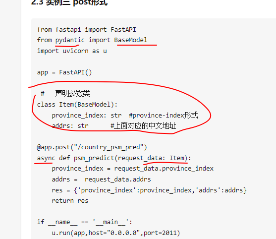
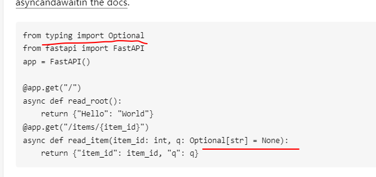

# 类型提示，type hint

python类型提示不一致时并不影响程序本身执行


类型提示两种实现方式：

Type Annotation

```python
import math

def circumference(radius: float) -> float:
    return 2 * math.pi * radius
print(circumference.__annotations__)

def test(request_data : Any):
    pass
```

- 使用`：`语句将信息附加到变量或函数参数中。，
- `->`运算符用于将信息附加到函数/方法的返回值中。

这种方法的好处是：

- 这是实现类型提示的规范方式，这意味着是类型提示中最干净的一种方式。
- 因为类型信息附加在代码的右侧，这样我们可以立刻明晰类型。

缺点是：

- 它不向后兼容。至少需要Python 3.6才能使用它。
- 强制你导入**所有**类型依赖项，即使它们根本不在运行时使用。
- 在类型提示中，会使用到复合类型，例如`List[int]`。而为了构造这些复杂类型，解释器在首次加载此文件时需要执行一些操作。

即在运行时基本上将所有类型信息作为注释处理。

为了解决这些矛盾，Python 3.7引入了 [PEP-563 ~ postponed evaluation of annotations](https://www.python.org/dev/peps/pep-0563/) 。

加入以下语句，解释器将不再构造这些复合类型。

```
from __future__ import annotations
```


Type Comment

```python
# headlines.py
def headline(
    text,           # type: str
    width=80,       # type: int
    fill_char="-",  # type: str
):                  # type: (...) -> str
return f" {text.title()} ".center(width, fill_char)

print(headline("type comments work", width=40))
```


鸭子类型，不通过其本身类型判断类型，而是通过其属性、表现判断







python typing、pydantic，两个做类型和格式检查


