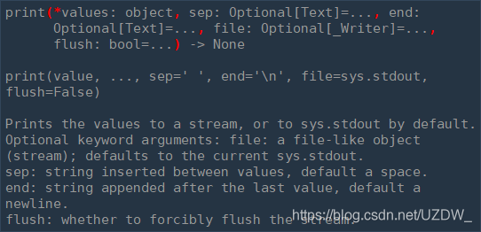
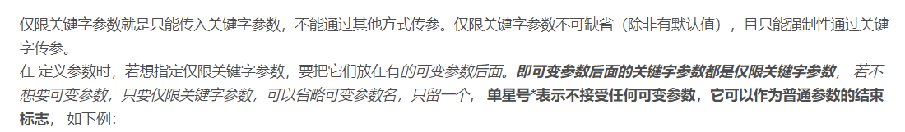

Python print()向上取整

**参数**
`values`，可以一次输出多个对象。输出多个对象时，需要用 , 分隔。

`sep`，用来间隔多个对象，默认值是一个空格。

`end`，用来设定以什么结尾。默认值是换行符 \n，我们可以换成其他字符串。

`file`，要写入的文件对象。

`flush`，输出是否被缓存通常决定于 file，但如果 flush 关键字参数为 True，流会被强制刷新。

**返回值**
无

Python numpy.ceil()

参数
x -- 数值表达式。
返回值
函数返回数字的上入整数。

python numpy.floor

### numpy.floor()

numpy.floor() 返回小于或者等于指定表达式的最大整数，即向下取整。

没有类的情况下，模块中的_get、__get方法就是普通方法

